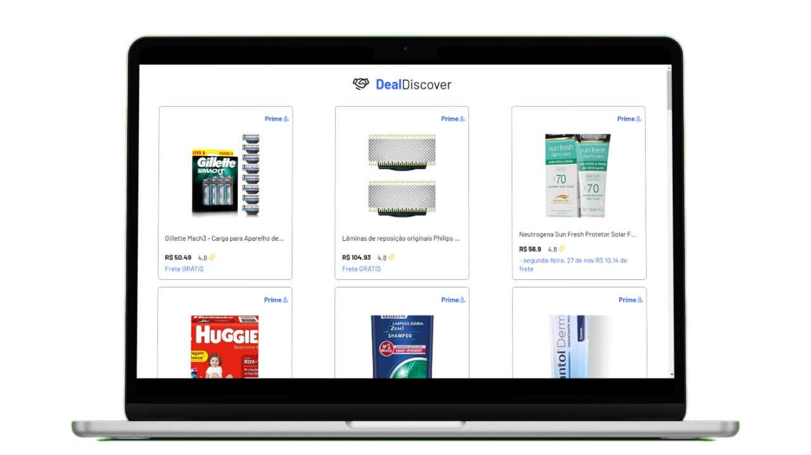

<h3 align="center">
    
</h3>

<h1 align="center">Deal Discover</h1>

<p align="center">
<a href="#project"></a>&nbsp;
<a href="#environment"></a>&nbsp;
<a href="#license"></a>&nbsp;
</p>

<h3 align="center">
  
</h3>

## Project

This project utilizes the Oxylabs API to provide detailed information about Amazon promotions in Brazil. 
Perfect for Black Friday, Deal Discover saves time by automating the search for significant deals, helping users quickly identify the best buying opportunities. 
Simplify your online shopping experience and don't miss out on great promotions! 🚀🛍️ 

### Demo:

<p align="center">

</p>

> `Alert 1:` For optimal experience, it is advisable not to use IE 6-8 as a browser due to certain styling features.

## Environment

Make sure you have the following installations:

- [Git](https://git-scm.com/)
- [Node](https://nodejs.org/en)
- [Npm](https://www.npmjs.com/)

### Setup Instructions:

1. Clone the repository: 
    ```bash 
    https://github.com/CaioLemec/DealDiscover.git
    ```
2. Install all dependencies by running:
    ```bash
    npm i
    ```
3. Follow the instructions in the env.example file to populate the environment variables.
    ```
    VITE_OXYLABS_API_USERNAME="api_username"
    VITE_OXYLABS_API_PASSWORD="api_password"
    ```
4. Start the application in <strong>dev</strong> mode:
    ```bash
    npm run dev
    ```
5. Ensure compatibility by checking the versions of dependencies.
---

## License

Licensed under MIT. Learn more in the [LICENSE](/LICENSE) file.

---

## Contact

Feel free to reach out for clarifications or feedback.


<em align="center">Caio Lemec</em>

[](mailto:caiolemec@gmail.com)
[](https://www.linkedin.com/in/caiolemec/)
